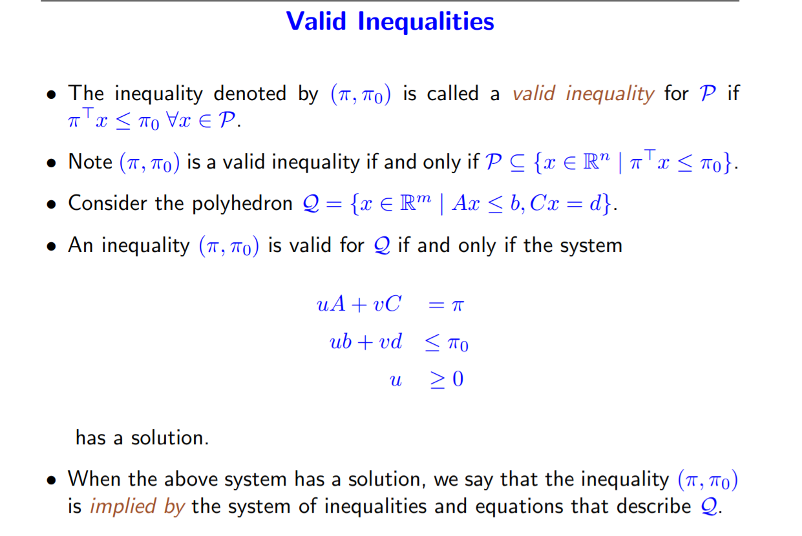

# MILP-Learning-notes
This is a learning notes of reading materials on MILP books and slides. The reference files will be provided later.
IP problems are usually linked with NP-hard problems, thus the computational complextity of this kind of problem is usually high. On the 
other hand, this is also a powerful tool to build modelings. The following thm provide a result on what kind of problems can be modeled by 
MILP.
**Representability Theorem** A set $F$ is $MILP$ representable iff there exist rational polytopes $P_1,...P_k$ and vectors $r^1,...r^t\in Z^n$ such that $F=\cup_{i=1}^k(P_i+intcone(r^1,...r^t))$.
 Here intcone stands for integer cone($intcone(X)=\{\lambda_1x_1+...+\lambda_tx_t|t\geq 0,x_1,...,x_n\in X,\lambda_i\in Z_+\}$)
#### Techniques in MILP
- Outer approximation
- Inner approximation
- Division
- Relaxation
- Duality
#### Formulations

Often, a given formulation can be strengthened with additional inequalities satisfied by all feasible integer solutions.
Ways to enhance a formulation:
- Add valid inequalities
- Make extended formulations
The first approach is about adding constraints which are satisfied by every feasible solution to get a stronger formulation. The second approach is about adding more variables and do "lifting". The variable of concern can be obtained by projection of the lifted new variable. The geometry  of this approach is expressed clearly by the following graph:
 
#### Valid Inequalities:
Adding valid inequalities might help us get a stronger formulation. Yet how to construct those is provided by the next slides

Notice the above system imply that the valid inequality is a linear combination of the existed inequalities and equalities.
Next we explore the property called face defining. The reason we are interested in facet-defining inequalities is because they are the “strongest” valid inequalities. There are infinite choices of valid inequalities we can add. Yet we want to develop the a system with good property, in the case, good means strong. In the slide, the concept "dominant" and minimal are introduced to characterize these properties. In short. face is a dimension reduction of the original polyhedron and can be deduced by changing some inequalities to equalities. While facet is the face whose dimension is 1 less than the original polyhedron and facet-defining inequalities can never be dominated. Thus, adding facet defining ineqs will increase the strength of the formulation to get tighter boundary.
